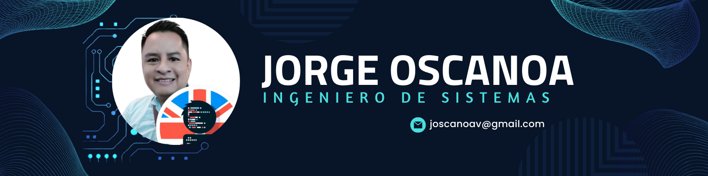

Hola, mi nombre es Jorge Oscanoa 👋
### Desarrollador full stack

Soy ingeniero de sistemas profesional desde 2020, graduado de la Universidad Federico Villarreal en Lima, Perú.

Trabajo como desarrollador de software freelance, con experiencia en Java, Python, JavaScript, PHP y frameworks modernos. También tengo habilidades en la gestión de bases de datos SQL y NoSQL, y en metodologías ágiles (Scrum, Kanban).

Desde 2020, soy docente a distancia de Programación e Inglés. Hablo inglés avanzado, perfeccionado en el Reino Unido, lo que facilita mi enseñanza en entornos multiculturales.

Apasionado por el desarrollo de profesionales en DAM y DAW, mi objetivo es compartir mi conocimiento y ayudar a más personas a acceder a la educación tecnológica.

## Encuéntrame en:

  

  

 

# Algunos proyectos de la comunidad

## Ruta de estudio programación

## Algunos vídeos en YouTube:

<table style="width:100%">
<tr>
<td>

</td>
<td>
<a href="https://youtu.be/3UCZltG8iCY">
/default.jpg">

</a>
</td>
<td>

</td>
</tr>
<tr>
<td>

</td>
<td>

</td>
<td>

</td>
</tr>
<tr>
<td>

</td>
<td>

</td>
<td>

</td>
</tr>
</table>

## Contacto y apoyo:

[_Gracias!-orange?style=for-the-badge&logo=Microsoft+Outlook&logoColor=white&labelColor=101010)](https://mypublicinbox.com/mouredev)
 
[-D14836?style=for-the-badge&logo=gmail&logoColor=white&labelColor=101010)](mailto:braismoure@mouredev.com)
 

